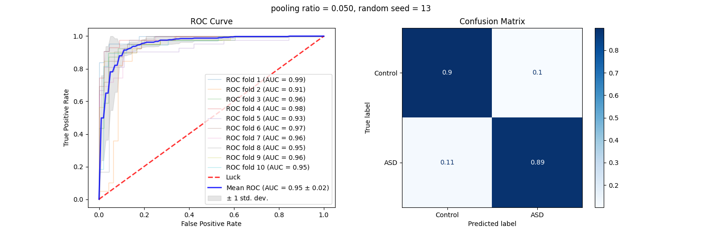
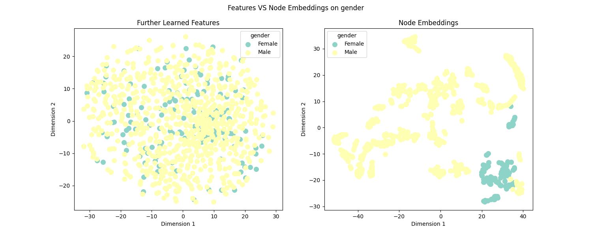

# Identifying Autism Spectrum Disorder Based on Individual-Aware Down-Sampling and Multi-Modal Learning

This is the GitHub repository for our paper: Identifying Autism Spectrum Disorder Based on Individual-Aware Down-Sampling and Multi-Modal Learning

## Requirements

torch == 1.8.1+cu102

torch-cluster == 1.5.9

torch-geometric == 1.7.0

torch-scatter == 2.0.7

torch-sparse == 0.6.10

sklearn

nilearn


Install torch-geometric:

```
pip install torch-scatter -f https://data.pyg.org/whl/torch-1.8.1+cu102.html
pip install torch-sparse -f https://data.pyg.org/whl/torch-1.8.1+cu102.html
pip install torch-cluster -f https://data.pyg.org/whl/torch-1.8.1+cu102.html
pip install torch-geometric
```

## Download ABIDE I dataset

```
python download_ABIDE.py
```

This script will automatically download ABIDE I dataset preprocessed by CPAC and construct the graph representation of the brain imaging.

## Run the diagnosis framework

Try the framework with Logistic Regression as the classifier:

```
python main.py --logistic
```

Or the GCN:

```
python main.py --gcn
```

main.py includes:

1. The unsupervised graph pooling. The results will by default be saved to /data/ABIDE_downsample/ with respect to different pooling ratios.
2. Training phase of the MLP under 10-fold cross-validation
3. Use the best model from the trained MLP to extract the further learned features from pooling results under the same cross-validation of 2.
4. train/test classifiers under the same cross-validation of 2.

## Evaluation

```
python visualize.py --roc --classifier=gcn
```

or 

```
python visualize.py --roc --classifier=lr
```

will plot the ROC curve and confusion matrix for the two classifiers respectively using the classification results saved to /results/



## Visualization

```
python visualize.py --embedding --group=gender
```

will compare the 2D distribution difference between the features learned by MLP and the node embeddings later learned by GCN and renders the nodes according to different groups (gender, age, site).



## Citation

Waiting for publication...